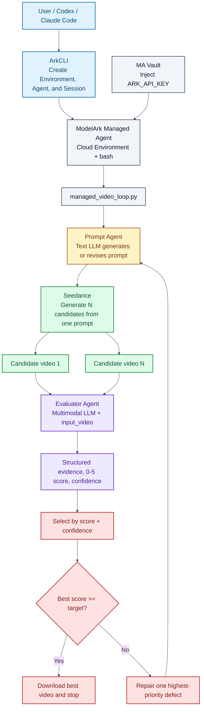

# ArkCLI + Managed Agent: Video Generation, Direct Evaluation, and Continuous Improvement

This guide presents a reproducible BytePlus ModelArk workflow. A Managed Agent runs one Python file inside a Cloud Environment. A text LLM generates or revises the Seedance prompt, Seedance produces multiple candidates, and a multimodal LLM receives each video through `input_video`, watches and listens to it, and scores it directly. When the best candidate misses the target, the runner repairs only the highest-priority defect and starts another round.

The default policy uses at most five rounds, two candidates per round, and a target score of 3.5 out of 5. Every value is user-configurable.

> Video generation is stochastic. This workflow reproduces the integration, evaluation contract, stopping rule, and artifact structure, not identical frames or scores. Five rounds with two candidates may generate up to ten videos and incur corresponding charges.

## 1. Architecture



Important boundary: a video URL in an MA text message is still only text. The runner calls the ModelArk Responses API and sends the temporary URL as `input_video.video_url`. This is the step that performs actual video and audio evaluation.

## 2. Repository Layout

```text
seedance-managed-video-loop/
├── README.md
├── managed_video_loop.py
├── requirements.txt
├── managed_agent_direct_bootstrap.sh
├── managed_agent_direct_system_prompt.txt
├── docs/
│   ├── guide.zh-CN.md
│   └── guide.en.md
├── tests/
│   └── test_managed_video_loop.py
└── examples/
    └── example-manifest.json
```

`managed_video_loop.py` is the only runtime entry point. It contains prompt generation, Seedance submission and polling, direct video evaluation, candidate selection, focused repair, early stopping, and video download.

## 3. Defaults and User Configuration

| Flag | Default | Meaning |
| --- | ---: | --- |
| `--max-rounds` | `5` | Maximum improvement rounds |
| `--candidates` | `2` | Candidates from the same prompt per round |
| `--target-score` | `3.5` | Early-stop threshold from 0 to 5 |
| `--timeout` | `1200` | Per-video polling timeout in seconds |
| `--video-model` | `dreamina-seedance-2-5-260628` | Video generation model |
| `--prompt-model` | `seed-2-0-lite-260428` | Prompt-agent model |
| `--evaluator-model` | `seed-2-0-lite-260428` | Direct video evaluator model |

Run with defaults:

```bash
python managed_video_loop.py
```

Override any value for cost, quality, or latency requirements:

```bash
python managed_video_loop.py \
  --max-rounds 3 \
  --candidates 4 \
  --target-score 4.2 \
  --timeout 1800 \
  --prompt-model seed-2-0-lite-260428 \
  --evaluator-model seed-2-0-lite-260428
```

## 4. Prerequisites

1. A BytePlus account with ModelArk, Managed Agents, Seedance, and the required models enabled.
2. BytePlus ArkCLI installed and authenticated with BytePlus SSO.
3. An active profile with `tenant=byteplus` and `region=ap-southeast-1`.
4. A valid ModelArk API key.
5. Python 3.10 or later.

Validate ArkCLI:

```bash
npm config delete registry
npm install -g @byteplus/ark-cli@latest
arkcli auth login
arkcli auth status --format json
arkcli profile show --format json
```

Confirm equivalent values:

```json
{
  "tenant": "byteplus",
  "region": "ap-southeast-1",
  "base_url": "https://ark.ap-southeast.bytepluses.com/api/v3"
}
```

## 5. Run Locally

```bash
git clone https://github.com/xieyongliang/seedance-managed-video-loop.git
cd seedance-managed-video-loop
python3 -m venv .venv
.venv/bin/pip install -r requirements.txt

export ARK_API_KEY="<your-modelark-api-key>"
.venv/bin/python managed_video_loop.py
```

Use a custom brief:

```bash
.venv/bin/python managed_video_loop.py \
  --brief-file ./my-video-brief.txt \
  --max-rounds 3 \
  --candidates 2 \
  --target-score 4.0
```

The default brief uses two public reference images, one reference video, and one reference audio file. For another business example, update `REFERENCES` in the code and provide the matching requirements through `--brief-file`.

Run the offline tests without API calls or video charges:

```bash
.venv/bin/python -m unittest discover -s tests -v
```

## 6. How Each Round Works

1. The Prompt Agent generates an English prompt that can be submitted directly to Seedance.
2. The runner appends the source brief as a non-negotiable constraint so later revisions cannot drift.
3. Seedance generates independent candidates from exactly the same prompt.
4. The runner polls each task and retrieves its temporary `video_url`.
5. The Evaluator Agent watches and listens to each candidate through `input_video`.
6. The evaluator returns structured evidence, score, confidence, passed requirements, and failed requirements.
7. The runner selects the best candidate by `(score, confidence)`.
8. It stops at the target or passes one highest-priority defect to the next Prompt Agent round.

Default priority signals cover exact speech, viewpoint, unintended text, timeline actions, continuity, and audio. The evaluator also returns `highest_priority_failure` for focused repair.

## 7. Direct Video Evaluation Contract

The evaluator must score observable evidence and must not infer sound from visuals. It returns JSON with:

- `score` from 0 to 5
- `confidence` from 0 to 1
- `summary`
- timestamped `timeline`
- `visual_evidence` and `audio_evidence`
- `exact_speech`
- `continuity_issues` and `unintended_text`
- `passed_requirements` and `failed_requirements`
- `highest_priority_failure`
- `improvement_instruction`

Scoring rubric:

| Score | Meaning |
| ---: | --- |
| 5 | All material requirements pass; no meaningful defect |
| 4 | Nearly complete; only minor defects remain |
| 3 | Usable, but one or more substantial requirements fail |
| 2 | Multiple major requirements fail |
| 1 | Poor match with little usable compliance |
| 0 | Invalid, inaccessible, or unrelated output |

## 8. Run Artifacts

```text
runs/<run-id>/
├── config.json
├── manifest.json
└── round-01/
    ├── prompt.txt
    ├── llm_prompt_generation.json
    ├── summary.json
    ├── candidate-01/
    │   ├── seedance_submit.json
    │   ├── seedance_result.json
    │   ├── llm_video_evaluation.json
    │   └── summary.json
    └── candidate-02/
        ├── ...
        └── video.mp4
```

Only the best candidate in each round is downloaded. `runs/` may contain temporary signed URLs and runtime data, so it is excluded by `.gitignore`.

## 9. Run Inside Managed Agent

### 9.1 Create a Vault

Securely prepare `./secrets/ark-api-key.txt` with only the API key. Do not place the value in shell history.

```bash
arkcli agent vault create \
  --display-name "arkcli-video-loop-vault-$(date -u +%Y%m%d%H%M%S)" \
  --format json

export VAULT_ID="vlt-xxxxxxxx"

arkcli agent vault credentials create "$VAULT_ID" \
  --display-name ark-api-key \
  --secret-name ARK_API_KEY \
  --secret-value @./secrets/ark-api-key.txt \
  --networking-type limited \
  --allowed-host ark.ap-southeast.bytepluses.com \
  --format json
```

### 9.2 Create the Cloud Environment

```bash
arkcli agent env create \
  --name "arkcli-video-loop-env-$(date -u +%Y%m%d%H%M%S)" \
  --description "Direct LLM video generation and evaluation loop" \
  --config '{Type: cloud, Networking: {Type: unrestricted}}' \
  --setup-script @managed_agent_direct_bootstrap.sh \
  --format json

export ENV_ID="env-xxxxxxxx"
```

### 9.3 Create the Agent

Select the primary model from the MA allowlist:

```bash
arkcli agent model list \
  --query "coding bash workflow orchestration" \
  --primary-only \
  --format json

export MA_MODEL_ID="<items[].model>"
```

Preview creation:

```bash
arkcli agent agent create \
  --name "arkcli-direct-video-loop-$(date -u +%Y%m%d%H%M%S)" \
  --description "Run direct LLM video generation and evaluation inside MA" \
  --model "$MA_MODEL_ID" \
  --system @managed_agent_direct_system_prompt.txt \
  --dry-run \
  --format json
```

Confirm that the default tools contain `bash`, `read`, and `write`. Remove `--dry-run`, create the Agent, and save `Result.Id`:

```bash
export AGENT_ID="agent-xxxxxxxx"
```

### 9.4 Create the Session and Mount the Runner

```bash
arkcli agent session create \
  --agent-id "$AGENT_ID" \
  --environment-id "$ENV_ID" \
  --vault-id "$VAULT_ID" \
  --title "Direct Seedance video evaluation" \
  --format json

export SESSION_ID="session-xxxxxxxx"

arkcli agent session resources add "$SESSION_ID" \
  --path ./managed_video_loop.py \
  --mount-path managed_video_loop.py \
  --format json
```

The file is mounted at:

```text
/mnt/session/uploads/managed_video_loop.py
```

### 9.5 Start the Task

```bash
arkcli agent session events send "$SESSION_ID" \
  --type user.message \
  --text 'Run the mounted video loop. Use max 5 rounds, 2 candidates per round, target score 3.5, and timeout 1200 seconds. Never print credentials. Return the final manifest summary and selected video path.' \
  --poll \
  --wait-timeout 7200 \
  --format json
```

If polling times out, continue reading the same Session instead of sending the task again:

```bash
arkcli agent session events list "$SESSION_ID" --page-all --format json
arkcli +tail "$SESSION_ID"
```

## 10. Acceptance Criteria

- The Prompt Agent produces a directly executable Seedance prompt.
- Candidates in one round use the same prompt but have different task IDs.
- The evaluator request contains `input_video` and returns AV evidence.
- `audio_tokens > 0`, with speech, music, or sound-effect findings.
- The evaluator returns a 0-5 score, confidence, and highest-priority failure.
- The runner selects correctly, stops at the target, and repairs only one defect when below it.
- The total rounds never exceed the user configuration.
- Agent Session events show the bash invocation and runner output.
- The Agent requires no public MCP endpoint.

## 11. Security and Persistence

- The repository requires only `ARK_API_KEY`, injected through an environment variable or MA Vault.
- Do not commit `.env`, secret source files, `runs/`, or generated videos.
- Seedance `video_url` values are temporary signed URLs. Evaluation can use them directly, but final delivery should download or copy the video to controlled object storage.
- `examples/example-manifest.json` illustrates the artifact schema without resource IDs, local paths, or signed URLs. It is not a live test result.

## 12. Current Verification Status

- The standalone runner uses no external prompt or evaluation SDK and directly depends only on `requests`.
- Python compilation and CLI defaults are verified.
- Offline simulations cover prompt parsing, direct video-evaluation payloads, candidate selection, and focused repair.
- The MA Environment and Agent requests can be validated with ArkCLI `--dry-run`.
- This revised direct-evaluation implementation still needs one real MA Cloud Session run for final end-to-end validation.
