# ArkCLI + Managed Agents: An End-to-End Video Generation, Evaluation, and Improvement Loop

This guide presents a reproducible BytePlus ModelArk workflow in which a Managed Agent runs a Python runner directly inside its cloud Environment. The runner uses PromptPilot to create a video prompt, Seedance to generate a video with audio, Seed 2.0 Lite to inspect the actual video and audio, and PromptPilot Eval to score the result. If the score is below the target, it repairs only the highest-priority defect and starts the next round. The primary workflow requires no public MCP deployment.

The example generates an 11-second, 16:9, first-person apple fruit tea advertisement. Each round creates two candidates from the same prompt. The loop runs for at most five rounds and stops as soon as the best candidate reaches 3.5 out of 5.

> Video generation is stochastic. This guide reproduces the integration, evaluation method, stopping rule, and artifact structure, but not necessarily the exact same frames or score. Two candidates per round and five rounds can generate up to ten videos and incur the corresponding usage charges.

## 1. Architecture

```mermaid
%%{init: {"theme": "base", "themeVariables": {"fontSize": "22px", "fontFamily": "Arial, sans-serif", "lineColor": "#334155"}, "flowchart": {"nodeSpacing": 60, "rankSpacing": 80, "curve": "basis"}}}%%
flowchart TB
    U["User / Codex / Claude Code"] --> CLI["ArkCLI<br/>Authenticate, create Agent, upload runner"]
    CLI --> MA["ModelArk Managed Agent<br/>Cloud Environment + bash"]
    VAULT["MA Vault<br/>Securely inject API keys and Workspace ID"] --> MA

    subgraph G1["1. Prompt generation"]
        direction TB
        PG["Python: generate_video_prompt"] --> PP["PromptPilot<br/>Generate or revise the prompt"]
    end

    subgraph G2["2. Video generation: two candidates from one prompt"]
        direction TB
        VS["Python: submit_video / wait_for_video"] --> SD["Seedance 2.5"]
        SD --> C1["Candidate video 1"]
        SD --> C2["Candidate video 2"]
    end

    subgraph G3["3. Video and audio understanding"]
        direction TB
        ANALYZE["Python: analyze_video"] --> SL["Seed 2.0 Lite<br/>Responses API + input_video"]
        SL --> REPORT["Timestamped structured AV report"]
    end

    subgraph G4["4. Evaluation, selection, and improvement"]
        direction TB
        PE["Python: evaluate_video"] --> SCORE["Score both candidates<br/>Select by score + confidence"]
        SCORE --> CHECK{"Is the best score >= 3.5?"}
        CHECK -->|"Yes"| DONE["Persist the best video and stop"]
        CHECK -->|"No"| FIX["Repair the highest-priority defect only<br/>Start next round, up to five rounds"]
    end

    MA --> PG
    PP --> VS
    C1 --> ANALYZE
    C2 --> ANALYZE
    REPORT --> PE
    FIX --> PG

    classDef entry fill:#e0f2fe,stroke:#0369a1,stroke-width:2px,color:#0c4a6e;
    classDef control fill:#f1f5f9,stroke:#475569,stroke-width:2px,color:#0f172a;
    classDef prompt fill:#fef3c7,stroke:#b45309,stroke-width:2px,color:#78350f;
    classDef video fill:#dcfce7,stroke:#15803d,stroke-width:2px,color:#14532d;
    classDef analysis fill:#ede9fe,stroke:#6d28d9,stroke-width:2px,color:#4c1d95;
    classDef decision fill:#fee2e2,stroke:#b91c1c,stroke-width:2px,color:#7f1d1d;
    class U,CLI entry;
    class MA,VAULT control;
    class PG,PP prompt;
    class VS,SD,C1,C2 video;
    class ANALYZE,SL,REPORT,PE analysis;
    class SCORE,CHECK,FIX,DONE decision;
```



Component responsibilities:

| Component | Responsibility |
| --- | --- |
| ArkCLI | BytePlus authentication, profile validation, Environment/Agent/Session creation, Vault attachment, and runner upload |
| Managed Agent | Use built-in bash inside the cloud Environment to start and supervise the complete Python loop |
| PromptPilot | Generate the first executable prompt, make focused revisions, and score the structured AV report |
| Seedance | Generate an 11-second video from the prompt and the reference image, video, and audio assets |
| Seed 2.0 Lite | Read the temporary URL through `input_video` and analyze visuals, speech, music, and sound effects |
| Python runner | Call all three services directly and control best-of-2 selection, retries, artifacts, and stopping |
| MA Vault | Inject API keys and Workspace ID into the Session as environment variables |

One boundary is especially important: placing a video URL in an MA text message does not mean that the model has watched the video. The runner's `analyze_video` function sends that URL to `/responses` as `input_video.video_url`. This is the step that performs actual video and audio understanding. PromptPilot Eval receives the resulting structured report, not the video file itself.

## 2. Example Project

This guide uses the following project layout:

```text
promptpilot-seedance-managed-loop/
├── README.md
├── managed_video_loop.py
├── requirements.txt
├── managed_agent_direct_bootstrap.sh
├── managed_agent_direct_system_prompt.txt
├── docs/
│   ├── guide.zh-CN.md
│   └── guide.en.md
├── examples/
│   └── verified-manifest.json
└── optional-mcp/
    ├── managed_agent_mcp.py
    ├── managed_agent_system_prompt.txt
    └── video_agent_loop.py
```

Key files:

- `managed_video_loop.py`: recommended standalone entry point containing the complete PromptPilot, Seedance, Seed 2.0 Lite, Eval, and best-of-N loop.
- `managed_agent_direct_bootstrap.sh`: install runner dependencies in the MA Environment.
- `managed_agent_direct_system_prompt.txt`: instruct MA to execute the mounted runner directly.
- `optional-mcp/`: optional external MCP architecture, not a primary workflow dependency.

Models and service endpoints used by the example:

```text
Seedance:        dreamina-seedance-2-5-260628
AV analysis:     seed-2-0-lite-260428
ModelArk API:    https://ark.ap-southeast.bytepluses.com/api/v3
PromptPilot API: https://prompt-pilot.ap-southeast.bytepluses.com
```

The MA primary model is responsible only for planning and starting the runner. It does not need to be the same as the AV analysis model. Select the MA model from the Managed Agent allowlist for the current account. In this example, the Python runner calls `seed-2-0-lite-260428` through the Responses API for video understanding.

## 3. Prerequisites

Prepare the following:

1. A BytePlus account with ModelArk, Managed Agents, Seedance, and the required models enabled.
2. BytePlus ArkCLI installed and authenticated through BytePlus SSO.
3. An active profile with `tenant=byteplus` and `region=ap-southeast-1`.
4. A valid ModelArk API key.
5. A PromptPilot API key and Workspace ID.
6. Python 3.10 or later.
7. An MA Cloud Environment that can reach the ModelArk and PromptPilot domains.

The PromptPilot Workspace ID is available in the Workbench URL:

```text
https://promptpilot.byteplus.com/workbench/<task-id>?revisionId=<revision-id>&workspaceId=ws-xxxxxxxx
                                                                                ^^^^^^^^^^^
```

The value of the `workspaceId` query parameter is `AGENTPILOT_WORKSPACE_ID`.

## 4. Validate the BytePlus ArkCLI Environment

Install the public BytePlus ArkCLI package:

```bash
npm config delete registry
npm install -g @byteplus/ark-cli@latest
arkcli --version
```

Sign in and inspect the active identity and profile:

```bash
arkcli auth login
arkcli auth status --format json
arkcli profile show --format json
```

Before continuing, verify that the output contains equivalent values:

```json
{
  "tenant": "byteplus",
  "region": "ap-southeast-1",
  "base_url": "https://ark.ap-southeast.bytepluses.com/api/v3"
}
```

If the default profile is incorrect, list and switch profiles:

```bash
arkcli profile list --format json
arkcli profile use <byteplus-ap-southeast-1-profile-name>
```

## 5. Install Dependencies and Configure Credentials

Enter the project directory and create a virtual environment:

```bash
cd /path/to/promptpilot-seedance-managed-loop
python3 -m venv .venv
.venv/bin/pip install -r requirements.txt
```

Set the required environment variables. Never store real credentials in source files, Markdown, Git, Agent prompts, or Session messages:

```bash
export ARK_API_KEY="<your-byteplus-modelark-api-key>"
export AGENTPILOT_API_KEY="<your-promptpilot-api-key>"
export AGENTPILOT_WORKSPACE_ID="ws-xxxxxxxx"
export AGENTPILOT_API_URL="https://prompt-pilot.ap-southeast.bytepluses.com"
```

## 6. Validate the Complete Loop Locally

Run the same best-of-N strategy locally before attaching it to MA. This is the fastest way to validate the API keys, model access, PromptPilot Workspace, and evaluation chain:

```bash
.venv/bin/python managed_video_loop.py
```

With no flags, the runner uses these defaults:

| Flag | Default | Meaning |
| --- | ---: | --- |
| `--max-rounds` | `5` | Maximum improvement rounds |
| `--candidates` | `2` | Candidates generated from the same prompt per round |
| `--target-score` | `3.5` | Early-stop threshold, valid from 0 to 5 |
| `--timeout` | `1200` | Per-video polling timeout in seconds |

These values are defaults, not fixed policy. Users can override them for cost, quality, or latency requirements. For example, use three rounds, four candidates per round, and a 4.2 threshold:

```bash
.venv/bin/python managed_video_loop.py \
  --max-rounds 3 \
  --candidates 4 \
  --target-score 4.2 \
  --timeout 1800 \
  --run-id demo-$(date -u +%Y%m%dT%H%M%SZ)
```

The default brief uses four public reference assets: two images, one video, and one audio file. To use a custom brief, save it as a UTF-8 text file:

```bash
.venv/bin/python managed_video_loop.py \
  --brief-file ./my-video-brief.txt \
  --max-rounds 5
```

Each round performs the following steps:

1. PromptPilot generates or revises a Seedance prompt.
2. The runner appends non-negotiable hard constraints so later revisions cannot drop requirements that already passed.
3. It submits two independent Seedance tasks using exactly the same prompt.
4. It polls both asynchronous tasks and obtains a temporary `video_url` for each successful candidate.
5. Seed 2.0 Lite analyzes the actual visuals and audio of both candidates.
6. PromptPilot Eval assigns a `score`, `confidence`, and written evaluation to each candidate.
7. The runner selects the best candidate by `(score, confidence)`.
8. It stops if the best score is at least 3.5. Otherwise, it carries only the highest-priority defect into the next round.

Defect priority:

```text
Exact speech > first-person POV and toast action > unintended text > timeline actions > continuity > other issues
```

The runner does not keep appending every historical comment to the prompt. Each round repairs one high-priority issue and preserves all passed requirements. This limits prompt growth and reduces regression oscillation.

## 7. Inspect the Run Artifacts

Each run creates the following structure:

```text
runs/<run-id>/
├── config.json
├── manifest.json
└── round-01/
    ├── prompt.txt
    ├── promptpilot_generation.json
    ├── summary.json
    ├── candidate-01/
    │   ├── seedance_submit.json
    │   ├── seedance_result.json
    │   ├── seed_analysis.json
    │   ├── promptpilot_evaluation.json
    │   └── summary.json
    └── candidate-02/
        ├── ...
        └── video.mp4
```

Only the best candidate in each round is downloaded as `video.mp4`. The analysis and evaluation stages use the temporary Seedance URL directly; they do not require a local download.

Inspect the manifest:

```bash
python3 -m json.tool runs/<run-id>/manifest.json
```

Key fields:

```json
{
  "strategy": "hard-constraints-focused-repair-best-of-n",
  "target_score": 3.5,
  "completed_rounds": 1,
  "generated_candidates": 2,
  "passed": true,
  "best_candidate": {
    "analysis_model": "seed-2-0-lite-260428",
    "audio_tokens": 68,
    "score": 4.0,
    "confidence": 0.95
  }
}
```

An `audio_tokens` value greater than zero is one indication that the analysis request consumed audio input. The final evidence should also include the speech, music, sound-effect, and silence analysis in `seed_analysis.json`.

## 8. Run the Workflow Directly in an MA Cloud Environment

The primary workflow does not start an MCP server. MA uses its default `bash/read/write` tools to execute the standalone `managed_video_loop.py` inside a Cloud Environment. The Python runner calls PromptPilot, Seedance, Seed 2.0 Lite, and Eval directly.

### 8.1 Create a Credential Vault

Securely prepare four local files, each containing exactly one value. Do not place the values directly in shell history:

```text
./secrets/ark-api-key.txt
./secrets/promptpilot-api-key.txt
./secrets/promptpilot-workspace-id.txt
./secrets/promptpilot-api-url.txt
```

The content of `promptpilot-api-url.txt` is:

```text
https://prompt-pilot.ap-southeast.bytepluses.com
```

Create the Vault:

```bash
arkcli agent vault create \
  --display-name "arkcli-video-loop-vault-$(date -u +%Y%m%d%H%M%S)" \
  --format json

export VAULT_ID="vlt-xxxxxxxx"
```

Register the four values as environment-variable credentials:

```bash
arkcli agent vault credentials create "$VAULT_ID" \
  --display-name ark-api-key \
  --secret-name ARK_API_KEY \
  --secret-value @./secrets/ark-api-key.txt \
  --networking-type limited \
  --allowed-host ark.ap-southeast.bytepluses.com \
  --format json

arkcli agent vault credentials create "$VAULT_ID" \
  --display-name promptpilot-api-key \
  --secret-name AGENTPILOT_API_KEY \
  --secret-value @./secrets/promptpilot-api-key.txt \
  --networking-type limited \
  --allowed-host prompt-pilot.ap-southeast.bytepluses.com \
  --format json

arkcli agent vault credentials create "$VAULT_ID" \
  --display-name promptpilot-workspace-id \
  --secret-name AGENTPILOT_WORKSPACE_ID \
  --secret-value @./secrets/promptpilot-workspace-id.txt \
  --networking-type limited \
  --allowed-host prompt-pilot.ap-southeast.bytepluses.com \
  --format json

arkcli agent vault credentials create "$VAULT_ID" \
  --display-name promptpilot-api-url \
  --secret-name AGENTPILOT_API_URL \
  --secret-value @./secrets/promptpilot-api-url.txt \
  --networking-type limited \
  --allowed-host prompt-pilot.ap-southeast.bytepluses.com \
  --format json
```

Do not use `credentials get` to display a secret. Confirm that four credentials exist with:

```bash
arkcli agent vault credentials list "$VAULT_ID" --format json
```

### 8.2 Create the Cloud Environment

The setup script installs `agent-pilot-sdk==0.1.8` and `requests`:

```bash
arkcli agent env create \
  --name "arkcli-video-loop-env-$(date -u +%Y%m%d%H%M%S)" \
  --description "Direct Python video generation and evaluation loop" \
  --config '{Type: cloud, Networking: {Type: unrestricted}}' \
  --setup-script @managed_agent_direct_bootstrap.sh \
  --format json

export ENV_ID="env-xxxxxxxx"
```

The Cloud Environment must be able to reach:

```text
ark.ap-southeast.bytepluses.com
prompt-pilot.ap-southeast.bytepluses.com
ark-doc.tos-ap-southeast-1.bytepluses.com
```

### 8.3 Create an Agent That Runs the Python Runner

Choose the primary model from the MA allowlist:

```bash
arkcli agent model list \
  --query "coding bash workflow orchestration" \
  --primary-only \
  --format json

export MA_MODEL_ID="<items[].model>"
```

Preview Agent creation:

```bash
arkcli agent agent create \
  --name "arkcli-direct-video-loop-$(date -u +%Y%m%d%H%M%S)" \
  --description "Run PromptPilot and Seedance evaluation loop inside MA" \
  --model "$MA_MODEL_ID" \
  --system @managed_agent_direct_system_prompt.txt \
  --dry-run \
  --format json
```

Confirm that the default `agent_toolset_20260701` includes `bash`, `read`, and `write`. Then remove `--dry-run` and create the Agent:

```bash
arkcli agent agent create \
  --name "arkcli-direct-video-loop-$(date -u +%Y%m%d%H%M%S)" \
  --description "Run PromptPilot and Seedance evaluation loop inside MA" \
  --model "$MA_MODEL_ID" \
  --system @managed_agent_direct_system_prompt.txt \
  --format json

export AGENT_ID="agent-xxxxxxxx"
arkcli agent agent get "$AGENT_ID" --format json
```

This Agent should have no `McpServers` or `mcp_toolset`. When `--tool` is omitted, ArkCLI supplies the default toolset containing bash, read, write, edit, and related tools.

### 8.4 Create a Session and Mount the Runner

Create a Session that binds both the Environment and Vault:

```bash
arkcli agent session create \
  --agent-id "$AGENT_ID" \
  --environment-id "$ENV_ID" \
  --vault-id "$VAULT_ID" \
  --title "Direct Seedance best-of-2 evaluation" \
  --format json

export SESSION_ID="session-xxxxxxxx"
```

Upload and mount the standalone runner:

```bash
arkcli agent session resources add "$SESSION_ID" \
  --path ./managed_video_loop.py \
  --mount-path managed_video_loop.py \
  --format json
```

The backend mounts them at:

```text
/mnt/session/uploads/managed_video_loop.py
```

Verify the Session, Vault attachment, and resources:

```bash
arkcli agent session get "$SESSION_ID" --format json
arkcli agent session resources list "$SESSION_ID" --format json
```

### 8.5 Start the Complete Loop

Send the task once and wait with polling. Do not resend the same task after a timeout:

```bash
arkcli agent session events send "$SESSION_ID" \
  --type user.message \
  --text 'Run the mounted V2 video loop now. Use max 5 rounds, 2 candidates per round, target score 3.5, timeout 1200 seconds, and a unique run ID. Never print credentials. Return the final manifest summary and selected video path.' \
  --poll \
  --wait-timeout 7200 \
  --format json
```

The command executed by MA is equivalent to:

```bash
RUN_DIR="/tmp/seedance-loop-$(date -u +%Y%m%dT%H%M%SZ)"
mkdir -p "$RUN_DIR"
cp /mnt/session/uploads/managed_video_loop.py "$RUN_DIR/"
cd "$RUN_DIR"
python3 managed_video_loop.py \
  --max-rounds 5 \
  --candidates 2 \
  --target-score 3.5 \
  --timeout 1200 \
  --run-id "ma-$(date -u +%Y%m%dT%H%M%SZ)"
```

If `events send --poll` times out, continue reading the same Session instead of sending the task again:

```bash
arkcli agent session events list "$SESSION_ID" --page-all --format json
arkcli +tail "$SESSION_ID"
```

### 8.6 Prove That MA Ran the Code Directly

Collect all of the following evidence:

1. Session events contain an MA `bash` tool call, not an MCP tool call.
2. The bash command copies `managed_video_loop.py` from `/mnt/session/uploads/` into `/tmp`.
3. Runner output shows two different Seedance task IDs and `seed-2-0-lite-260428`.
4. Final output contains `manifest.json`, `score`, `audio_tokens`, `passed`, and the selected video path.
5. The Agent configuration has an empty `McpServers` list.

`/tmp` and the Session filesystem are ephemeral. For validation, download the video while the manifest's temporary URL is valid. For delivery, add a TOS or object-storage persistence step.

## 9. Optional External MCP Architecture

Use a public MCP only when the five operations must be independent, reusable, and observable MA tools. It is not a prerequisite for the direct-execution workflow above.

### 9.1 Expose the Workflow as an MCP Service

`optional-mcp/managed_agent_mcp.py` exposes five tools:

| Tool | Input | Output |
| --- | --- | --- |
| `prompt_generate` | Brief, current prompt, and one focused defect | A Seedance-ready prompt |
| `video_submit` | Prompt | Seedance task ID |
| `video_status` | Task ID | Task status and, on success, a temporary video URL |
| `video_audio_analyze` | Video URL and original brief | Structured Seed 2.0 Lite AV report and usage |
| `promptpilot_eval` | Brief, AV report, and round number | Score from 0 to 5, confidence, and improvement feedback |

Start the service locally:

```bash
FASTMCP_HOST=0.0.0.0 FASTMCP_PORT=8000 \
  .venv/bin/python optional-mcp/managed_agent_mcp.py
```

The local Streamable HTTP endpoint is:

```text
http://127.0.0.1:8000/mcp
```

For Managed Agent use, deploy this service to a public HTTPS environment reachable from MA and configure the four environment variables from Section 5 on the server. The deployed endpoint should look like this:

```text
https://<your-mcp-service-domain>/mcp
```

Do not configure a cloud-hosted MA with `127.0.0.1` or a private-only address. A production deployment should also add MCP authentication, request auditing, concurrency limits, and timeouts. The API keys remain in the MCP service and never enter the Agent prompt or Session history.

### 9.2 Create an MCP-Enabled Managed Agent with ArkCLI

First inspect the MA model allowlist. Do not guess or manually construct a model ID:

```bash
arkcli agent model list \
  --query "tool calling workflow orchestration" \
  --primary-only \
  --format json
```

Select a tool-capable model from `items[].model`:

```bash
export MA_MODEL_ID="<items[].model>"
export MCP_SERVER_URL="https://<your-mcp-service-domain>/mcp"
```

Preview Agent creation without network requests or side effects:

```bash
arkcli agent agent create \
  --name "arkcli-video-eval-loop-$(date -u +%Y%m%d%H%M%S)" \
  --description "PromptPilot + Seedance video generation and evaluation loop" \
  --model "$MA_MODEL_ID" \
  --system @optional-mcp/managed_agent_system_prompt.txt \
  --mcp-server "{type: url, name: video_loop, url: $MCP_SERVER_URL}" \
  --tool '[{type: mcp_toolset, name: video_loop, mcp_server_name: video_loop, default_config: {enabled: true, permission_policy: {type: always_allow}}}]' \
  --dry-run \
  --format json
```

After checking `Model`, `System`, `McpServers`, and `Tools` in the preview, remove `--dry-run` to create the Agent:

```bash
arkcli agent agent create \
  --name "arkcli-video-eval-loop-$(date -u +%Y%m%d%H%M%S)" \
  --description "PromptPilot + Seedance video generation and evaluation loop" \
  --model "$MA_MODEL_ID" \
  --system @optional-mcp/managed_agent_system_prompt.txt \
  --mcp-server "{type: url, name: video_loop, url: $MCP_SERVER_URL}" \
  --tool '[{type: mcp_toolset, name: video_loop, mcp_server_name: video_loop, default_config: {enabled: true, permission_policy: {type: always_allow}}}]' \
  --format json
```

Save `Result.Id` from the response and read the persisted server configuration:

```bash
export AGENT_ID="agent-xxxxxxxx"
arkcli agent agent get "$AGENT_ID" --format json
```

Verify the following:

- `McpServers[0].Name` is `video_loop`.
- `McpServers[0].Url` is the public HTTPS `/mcp` endpoint.
- `Tools` contains `Type=mcp_toolset` and `McpServerName=video_loop`.
- `System` specifies two candidates per round, a 3.5 threshold, no more than five rounds, and focused single-defect repair.

This example explicitly passes `--tool`, which replaces the complete default tool list. The video loop needs only the MCP tools and does not depend on the MA bash, read, write, or other default tools.

### 9.3 Create an MCP Agent Session and Run the Workflow

If the account has no usable Environment, create one:

```bash
arkcli agent env create \
  --name "arkcli-video-loop-env-$(date -u +%Y%m%d%H%M%S)" \
  --description "Environment for the managed video loop" \
  --format json
```

`+new session` automatically selects the most recently created Environment in the current project. Submit the brief and wait for completion:

```bash
arkcli +new session "$AGENT_ID" \
  --title "Seedance fruit tea best-of-2 evaluation" \
  --message 'Create an 11-second, 16:9 first-person POV fruit-tea promotional video with generated audio. Use the supplied reference assets. Keep exact timeline actions, exact female dialogue, continuous music, synchronized effects, product continuity, and no unintended overlay text. Generate two candidates per round, select the better one, stop at 3.5/5, and run at most five rounds.' \
  --format json
```

For long-running jobs, create the Session first and use polling:

```bash
arkcli agent session create \
  --agent-id "$AGENT_ID" \
  --title "Seedance fruit tea best-of-2 evaluation" \
  --format json
```

Save the returned Session ID:

```bash
export SESSION_ID="session-xxxxxxxx"
arkcli agent session events send "$SESSION_ID" \
  --type user.message \
  --text 'Run the complete video generation and evaluation loop for the fruit-tea brief. Use two candidates per round, threshold 3.5, and at most five rounds.' \
  --poll \
  --wait-timeout 1800 \
  --format json
```

Do not resend the same user message while a Seedance task is pending or running. If polling times out, continue reading events from the same Session instead of creating duplicate video tasks:

```bash
arkcli agent session events list "$SESSION_ID" --format json
arkcli +tail "$SESSION_ID"
```

## 10. Acceptance Criteria

A complete run should verify all of the following:

- PromptPilot produces an English Seedance prompt that can be submitted directly.
- The two Seedance task IDs in each round are different, while their prompts are identical.
- Every successful candidate contains `content.video_url`.
- Video understanding returns `model=seed-2-0-lite-260428`.
- `seed_analysis.json` contains timestamped visual, speech, music, sound-effect, and continuity findings.
- PromptPilot Eval returns a score from 0 to 5 and actionable failure details.
- The loop selects the best candidate by score and confidence.
- It stops at 3.5 or repairs only one highest-priority defect when below the threshold.
- It never exceeds five rounds.
- The selected video is persisted instead of relying on an expiring URL.

## 11. Verified Example Result

The `4.0/5` result below was produced locally by the pre-merge V2 runner with the same logic. It verifies the PromptPilot, Seedance, Seed 2.0 Lite, and Eval loop itself; that logic is now consolidated in `managed_video_loop.py`. The MA direct-execution Environment and Agent requests have been validated with ArkCLI `--dry-run`; one real Cloud Session run following Section 8 is still required before claiming that the MA-hosted execution path has passed end to end.

One verified run used these settings:

```text
Strategy:             hard-constraints-focused-repair-best-of-n
Threshold:            3.5/5
Candidates per round: 2
Maximum rounds:       3 (the first round passed, so no further round was needed)
```

First-round results:

| Candidate | Eval score | Outcome |
| --- | ---: | --- |
| Candidate 1 | 2.0/5 | Not selected |
| Candidate 2 | 4.0/5 | Selected and passed |

`seed-2-0-lite-260428` analyzed the selected candidate with `audio_tokens=68` and analysis confidence `0.95`. The required actions, first-person POV, two female voice lines, background music, synchronized effects, and product continuity passed. The main remaining defect was an unrequested `seedance new release` overlay in the final shot. Because 4.0 exceeded the 3.5 threshold, the loop stopped after the first round and generated only two videos.

The repository includes a sanitized result summary:

```text
examples/verified-manifest.json
```

Generated videos and complete `runs/` directories are excluded from Git so binary files, temporary signed URLs, and runtime data do not enter the repository.

## 12. Temporary URLs and Persistence

The `content.video_url` returned by Seedance is signed and expires. Seed 2.0 Lite can analyze it directly while it remains valid, so evaluation does not require a local download first.

Do not use a temporary URL as the final delivery URL. Use at least one of these approaches:

1. Download the best candidate immediately as `video.mp4`, as implemented by `managed_video_loop.py`.
2. Add a TOS or object-storage upload step to the runner and return a durable URL after persistence.

If a temporary URL expires, query the original `task_id` for refreshed task details. Do not submit a new generation task unless the service confirms that the original task no longer exists or cannot be recovered.

## 13. FAQ

### Why can the MA not evaluate a video merely because it received a URL?

An MA `user.message` natively carries text, images, and documents. A video URL in text is still only a string. This example has the Python runner call `/responses` and explicitly send `input_video`, allowing the multimodal model to inspect both video and audio.

### Does PromptPilot watch the video directly?

Not in this example. Seed 2.0 Lite first converts the video into timestamped structured AV evidence. PromptPilot Eval then scores that report against the original brief. Separating evidence extraction from scoring makes the feedback more suitable for the next prompt revision.

### Why generate two candidates per round?

Video generation is stochastic, and two outputs from the same prompt may differ significantly. Best-of-2 uses that variance before changing the prompt. In the verified run, the same prompt produced candidates scoring 2.0 and 4.0; selection alone reached the target.

### Why repair only one defect per round?

Accumulating all historical feedback makes prompts longer and can cause previously passed criteria to regress. Fixed hard constraints plus one focused repair per round keep changes small and make their effect easier to attribute.

### Does a score of 3.5 mean the video has no defects?

No. A score of 3.5 is the business acceptance threshold for this example. The verified 4.0 video still contained an unintended text overlay. Production systems should choose thresholds based on brand, compliance, and delivery requirements, and may apply hard rejection rules to critical constraints instead of relying only on the aggregate score.

## 14. Reproduction Checklist

- [ ] `arkcli auth status` reports `tenant=byteplus`.
- [ ] The active profile uses `ap-southeast-1` and a `bytepluses.com` base URL.
- [ ] All four environment variables are injected into the MA Session through Vault.
- [ ] The local V2 runner creates `manifest.json` and a winning `video.mp4`.
- [ ] The Cloud Environment uses unrestricted networking and installs its dependencies successfully.
- [ ] The Agent uses the default bash/read/write tools and has no `McpServers`.
- [ ] The final Agent configuration has been verified with `agent get`.
- [ ] `managed_video_loop.py` is mounted under `/mnt/session/uploads/`.
- [ ] Session events show the MA bash call and runner output.
- [ ] Seed analysis includes audio evidence, and PromptPilot Eval returns a score.
- [ ] The loop stops when it passes or after no more than five rounds.
- [ ] The selected video is persisted and does not depend on an expired temporary URL.
