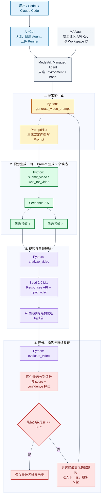

# ArkCLI + Managed Agents：视频生成、评估与持续改善完整示例

本文给出一个可复现的 BytePlus ModelArk 工作流：Managed Agent 在自己的云端 Environment 中直接运行 Python Runner，使用 PromptPilot 生成视频提示词，调用 Seedance 生成带音频的视频，由 Seed 2.0 Lite 理解实际视频和音频，再由 PromptPilot Eval 评分。若未达到阈值，Runner 只修复最高优先级缺陷并进入下一轮。主方案不需要部署公网 MCP。

示例目标是生成一条 11 秒、16:9、第一人称视角的苹果果茶广告。默认每轮生成 2 个候选，最多运行 5 轮，评分达到 3.5/5 即停止。

> 视频生成具有随机性。复现的是完整调用链、评估方法、停止条件和产物结构，不保证每次生成完全相同的画面或分数。每轮 2 个候选、最多 5 轮意味着最坏情况下会生成 10 条视频并产生相应费用。

## 1. 方案概览



各组件的职责如下：

| 组件 | 职责 |
| --- | --- |
| ArkCLI | BytePlus 登录、Profile 检查、创建 Environment/Agent/Session、挂载 Vault、上传 Runner |
| Managed Agent | 使用内置 bash 在云端 Environment 中启动并监督完整 Python 闭环 |
| PromptPilot | 首轮生成可执行提示词；后续根据单一缺陷定向改写；对视听分析报告评分 |
| Seedance | 根据提示词和参考图片、视频、音频生成 11 秒视频 |
| Seed 2.0 Lite | 通过 Responses API 的 `input_video` 读取临时 URL，分析画面、对白、音乐和音效 |
| Python Runner | 直接调用三个服务，控制 best-of-2、阈值、重试、产物和停止条件 |
| MA Vault | 将 API Key 和 Workspace ID 作为环境变量安全注入 Session |

这里有一个关键边界：把视频 URL 当作普通文本发给 MA，并不等于模型已经识别视频。Runner 的 `analyze_video` 会把 URL 放入 `/responses` 的 `input_video.video_url`，这一步才是真正的视频与音频理解。PromptPilot Eval 接收的是结构化理解结果，而不是视频文件本身。

## 2. 示例代码

本文对应目录：

```text
promptpilot-seedance-managed-loop/
├── README.md
├── managed_video_loop.py
├── requirements.txt
├── managed_agent_direct_bootstrap.sh
├── managed_agent_direct_system_prompt.txt
├── docs/
│   ├── guide.zh-CN.md
│   └── guide.en.md
├── examples/
│   └── verified-manifest.json
└── optional-mcp/
    ├── managed_agent_mcp.py
    ├── managed_agent_system_prompt.txt
    └── video_agent_loop.py
```

核心文件：

- `managed_video_loop.py`：推荐的单文件入口，包含 PromptPilot、Seedance、Seed 2.0 Lite、Eval 和 best-of-N 完整闭环。
- `managed_agent_direct_bootstrap.sh`：初始化 MA Environment，安装 Runner 所需依赖。
- `managed_agent_direct_system_prompt.txt`：指导 MA 直接运行 Session 中挂载的 Runner。
- `optional-mcp/`：可选的外部 MCP 方案，不是主流程依赖。

代码中使用的模型与服务地址：

```text
Seedance:        dreamina-seedance-2-5-260628
视频理解:        seed-2-0-lite-260428
ModelArk API:    https://ark.ap-southeast.bytepluses.com/api/v3
PromptPilot API: https://prompt-pilot.ap-southeast.bytepluses.com
```

MA 自身的主模型只负责规划和启动 Runner，不需要与视频理解模型相同。创建 MA 时必须从当前账号的 Managed Agent 模型白名单中选择；`seed-2-0-lite-260428` 在本例中由 Python Runner 通过 Responses API 直接调用，负责视频理解。

## 3. 前置条件

需要准备：

1. BytePlus 账号已开通 ModelArk、Managed Agents、Seedance 和相关模型能力。
2. BytePlus ArkCLI 已安装，并已通过 BytePlus SSO 登录。
3. 当前 Profile 为 `tenant=byteplus`、`region=ap-southeast-1`。
4. 一个可用的 ModelArk API Key。
5. PromptPilot API Key 和 Workspace ID。
6. Python 3.10 或更高版本。
7. 一个允许访问 ModelArk 和 PromptPilot 域名的 MA Cloud Environment。

PromptPilot Workspace ID 可从 Workbench URL 中读取，例如：

```text
https://promptpilot.byteplus.com/workbench/<task-id>?revisionId=<revision-id>&workspaceId=ws-xxxxxxxx
                                                                                ^^^^^^^^^^^
```

`workspaceId` 参数的值就是 `AGENTPILOT_WORKSPACE_ID`。

## 4. 检查 BytePlus ArkCLI 环境

安装公开版 ArkCLI：

```bash
npm config delete registry
npm install -g @byteplus/ark-cli@latest
arkcli --version
```

登录并检查身份：

```bash
arkcli auth login
arkcli auth status --format json
arkcli profile show --format json
```

继续前应确认输出包含类似字段：

```json
{
  "tenant": "byteplus",
  "region": "ap-southeast-1",
  "base_url": "https://ark.ap-southeast.bytepluses.com/api/v3"
}
```

如果当前默认 Profile 不正确，先查看并切换：

```bash
arkcli profile list --format json
arkcli profile use <byteplus-ap-southeast-1-profile-name>
```

## 5. 安装 Python 依赖并配置密钥

进入示例目录：

```bash
cd /path/to/promptpilot-seedance-managed-loop
python3 -m venv .venv
.venv/bin/pip install -r requirements.txt
```

设置环境变量。不要把真实密钥写入代码、Markdown、Git 或 MA 的消息历史：

```bash
export ARK_API_KEY="<your-byteplus-modelark-api-key>"
export AGENTPILOT_API_KEY="<your-promptpilot-api-key>"
export AGENTPILOT_WORKSPACE_ID="ws-xxxxxxxx"
export AGENTPILOT_API_URL="https://prompt-pilot.ap-southeast.bytepluses.com"
```

## 6. 先用本地 Runner 完整验通

先运行与 MA 相同的闭环逻辑，可以最快验证 API Key、模型权限、PromptPilot Workspace 和评分链路：

```bash
.venv/bin/python managed_video_loop.py
```

不传参数时使用以下默认策略：

| 参数 | 默认值 | 含义 |
| --- | ---: | --- |
| `--max-rounds` | `5` | 最多改善轮数 |
| `--candidates` | `2` | 每轮使用同一 Prompt 生成的候选数量 |
| `--target-score` | `3.5` | 达到后提前停止，合法范围为 0-5 |
| `--timeout` | `1200` | 每个视频任务的轮询超时秒数 |

这些只是默认值，用户可以按成本、质量和时延要求覆盖。例如使用最多 3 轮、每轮 4 个候选、阈值 4.2：

```bash
.venv/bin/python managed_video_loop.py \
  --max-rounds 3 \
  --candidates 4 \
  --target-score 4.2 \
  --timeout 1800 \
  --run-id demo-$(date -u +%Y%m%dT%H%M%SZ)
```

默认 brief 已包含四个公开参考资源：两张参考图、一段参考视频和一段参考音频。也可以将自己的 brief 写入 UTF-8 文本文件：

```bash
.venv/bin/python managed_video_loop.py \
  --brief-file ./my-video-brief.txt \
  --max-rounds 5
```

每轮执行过程：

1. PromptPilot 生成或定向改写 Seedance 提示词。
2. 程序追加不可协商的硬约束，防止后续改写丢失已经满足的要求。
3. 用完全相同的 Prompt 并行提交 2 个 Seedance 候选。
4. 轮询两个异步任务，成功后取得临时 `video_url`。
5. Seed 2.0 Lite 分别分析两个候选的实际画面和音频。
6. PromptPilot Eval 分别给出 `score`、`confidence` 和评语。
7. 按 `(score, confidence)` 选择最佳候选。
8. 若最佳分数达到 3.5，立即停止；否则只提取最高优先级缺陷进入下一轮。

缺陷优先级为：

```text
精确对白 > 第一人称与举杯动作 > 意外文字 > 时间线动作 > 连续性 > 其他问题
```

程序不会把历轮所有反馈不断追加到 Prompt 中。每次只修一个最高优先级问题，并保持其他已通过要求不变，以减少提示词膨胀和指标来回波动。

## 7. 检查运行产物

每次运行会生成：

```text
runs/<run-id>/
├── config.json
├── manifest.json
└── round-01/
    ├── prompt.txt
    ├── promptpilot_generation.json
    ├── summary.json
    ├── candidate-01/
    │   ├── seedance_submit.json
    │   ├── seedance_result.json
    │   ├── seed_analysis.json
    │   ├── promptpilot_evaluation.json
    │   └── summary.json
    └── candidate-02/
        ├── ...
        └── video.mp4
```

只有每轮最佳候选会下载为本地 `video.mp4`。分析和 Eval 阶段直接使用 Seedance 返回的临时 URL，不要求先下载视频。

验收 `manifest.json`：

```bash
python3 -m json.tool runs/<run-id>/manifest.json
```

重点字段：

```json
{
  "strategy": "hard-constraints-focused-repair-best-of-n",
  "target_score": 3.5,
  "completed_rounds": 1,
  "generated_candidates": 2,
  "passed": true,
  "best_candidate": {
    "analysis_model": "seed-2-0-lite-260428",
    "audio_tokens": 68,
    "score": 4.0,
    "confidence": 0.95
  }
}
```

`audio_tokens > 0` 是视频理解请求实际消费音频输入的证据之一。最终判断仍应结合 `seed_analysis.json` 中的对白、音乐、音效和静音区间分析。

## 8. 在 MA Cloud Environment 中直接运行

主方案不启动 MCP Server。MA 使用默认的 `bash/read/write` 工具，在 Cloud Environment 中直接执行单文件 `managed_video_loop.py`。Python Runner 自己完成 PromptPilot、Seedance、Seed 2.0 Lite 和 Eval 的全部 API 调用。

### 8.1 创建凭证 Vault

先在本地安全地准备四个只包含单个值的文本文件，不要把值写入命令历史：

```text
./secrets/ark-api-key.txt
./secrets/promptpilot-api-key.txt
./secrets/promptpilot-workspace-id.txt
./secrets/promptpilot-api-url.txt
```

其中 `promptpilot-api-url.txt` 的内容为：

```text
https://prompt-pilot.ap-southeast.bytepluses.com
```

创建 Vault：

```bash
arkcli agent vault create \
  --display-name "arkcli-video-loop-vault-$(date -u +%Y%m%d%H%M%S)" \
  --format json
```

保存返回的 Vault ID：

```bash
export VAULT_ID="vlt-xxxxxxxx"
```

将四个值注册为 Environment Variable Credential：

```bash
arkcli agent vault credentials create "$VAULT_ID" \
  --display-name ark-api-key \
  --secret-name ARK_API_KEY \
  --secret-value @./secrets/ark-api-key.txt \
  --networking-type limited \
  --allowed-host ark.ap-southeast.bytepluses.com \
  --format json

arkcli agent vault credentials create "$VAULT_ID" \
  --display-name promptpilot-api-key \
  --secret-name AGENTPILOT_API_KEY \
  --secret-value @./secrets/promptpilot-api-key.txt \
  --networking-type limited \
  --allowed-host prompt-pilot.ap-southeast.bytepluses.com \
  --format json

arkcli agent vault credentials create "$VAULT_ID" \
  --display-name promptpilot-workspace-id \
  --secret-name AGENTPILOT_WORKSPACE_ID \
  --secret-value @./secrets/promptpilot-workspace-id.txt \
  --networking-type limited \
  --allowed-host prompt-pilot.ap-southeast.bytepluses.com \
  --format json

arkcli agent vault credentials create "$VAULT_ID" \
  --display-name promptpilot-api-url \
  --secret-name AGENTPILOT_API_URL \
  --secret-value @./secrets/promptpilot-api-url.txt \
  --networking-type limited \
  --allowed-host prompt-pilot.ap-southeast.bytepluses.com \
  --format json
```

不要使用 `credentials get` 回显 Secret。用列表确认四条凭证已经创建：

```bash
arkcli agent vault credentials list "$VAULT_ID" --format json
```

### 8.2 创建 Cloud Environment

初始化脚本会安装 `agent-pilot-sdk==0.1.8` 和 `requests`：

```bash
arkcli agent env create \
  --name "arkcli-video-loop-env-$(date -u +%Y%m%d%H%M%S)" \
  --description "Direct Python video generation and evaluation loop" \
  --config '{Type: cloud, Networking: {Type: unrestricted}}' \
  --setup-script @managed_agent_direct_bootstrap.sh \
  --format json
```

保存返回的 Environment ID：

```bash
export ENV_ID="env-xxxxxxxx"
```

这里必须使用 Cloud Environment，并允许访问以下域名：

```text
ark.ap-southeast.bytepluses.com
prompt-pilot.ap-southeast.bytepluses.com
ark-doc.tos-ap-southeast-1.bytepluses.com
```

### 8.3 创建直接执行 Runner 的 Agent

先从 MA 白名单选择主模型：

```bash
arkcli agent model list \
  --query "coding bash workflow orchestration" \
  --primary-only \
  --format json

export MA_MODEL_ID="<items[].model>"
```

先预览创建请求：

```bash
arkcli agent agent create \
  --name "arkcli-direct-video-loop-$(date -u +%Y%m%d%H%M%S)" \
  --description "Run PromptPilot and Seedance evaluation loop inside MA" \
  --model "$MA_MODEL_ID" \
  --system @managed_agent_direct_system_prompt.txt \
  --dry-run \
  --format json
```

确认预览中的默认 `agent_toolset_20260701` 包含 `bash`、`read` 和 `write`，然后删除 `--dry-run` 创建：

```bash
arkcli agent agent create \
  --name "arkcli-direct-video-loop-$(date -u +%Y%m%d%H%M%S)" \
  --description "Run PromptPilot and Seedance evaluation loop inside MA" \
  --model "$MA_MODEL_ID" \
  --system @managed_agent_direct_system_prompt.txt \
  --format json
```

保存 Agent ID 并回读最终配置：

```bash
export AGENT_ID="agent-xxxxxxxx"
arkcli agent agent get "$AGENT_ID" --format json
```

这个 Agent 不应配置 `McpServers` 或 `mcp_toolset`。不传 `--tool` 时，ArkCLI 会注入包含 bash/read/write/edit 等能力的默认工具集。

### 8.4 创建 Session 并挂载代码

创建 Session 时同时绑定 Environment 和 Vault：

```bash
arkcli agent session create \
  --agent-id "$AGENT_ID" \
  --environment-id "$ENV_ID" \
  --vault-id "$VAULT_ID" \
  --title "Direct Seedance best-of-2 evaluation" \
  --format json
```

保存 Session ID：

```bash
export SESSION_ID="session-xxxxxxxx"
```

上传并挂载单文件 Runner：

```bash
arkcli agent session resources add "$SESSION_ID" \
  --path ./managed_video_loop.py \
  --mount-path managed_video_loop.py \
  --format json
```

后端会把它们挂载到：

```text
/mnt/session/uploads/managed_video_loop.py
```

确认 Session、Vault 和文件资源：

```bash
arkcli agent session get "$SESSION_ID" --format json
arkcli agent session resources list "$SESSION_ID" --format json
```

### 8.5 启动完整闭环

发送一次任务并用 polling 等待。不要在超时后重复发送同一消息：

```bash
arkcli agent session events send "$SESSION_ID" \
  --type user.message \
  --text 'Run the mounted V2 video loop now. Use max 5 rounds, 2 candidates per round, target score 3.5, timeout 1200 seconds, and a unique run ID. Never print credentials. Return the final manifest summary and selected video path.' \
  --poll \
  --wait-timeout 7200 \
  --format json
```

MA 执行的核心命令等价于：

```bash
RUN_DIR="/tmp/seedance-loop-$(date -u +%Y%m%dT%H%M%SZ)"
mkdir -p "$RUN_DIR"
cp /mnt/session/uploads/managed_video_loop.py "$RUN_DIR/"
cd "$RUN_DIR"
python3 managed_video_loop.py \
  --max-rounds 5 \
  --candidates 2 \
  --target-score 3.5 \
  --timeout 1200 \
  --run-id "ma-$(date -u +%Y%m%dT%H%M%SZ)"
```

如果 `events send --poll` 等待超时，继续读取同一个 Session，不要重发：

```bash
arkcli agent session events list "$SESSION_ID" --page-all --format json
arkcli +tail "$SESSION_ID"
```

### 8.6 验证 MA 确实直接运行了代码

需要同时看到以下证据：

1. Session events 中有 MA 的 `bash` 工具调用，而不是 MCP 工具调用。
2. bash 命令从 `/mnt/session/uploads/` 复制 `managed_video_loop.py` 到 `/tmp`。
3. Runner 输出两个不同的 Seedance task ID，并显示 `seed-2-0-lite-260428`。
4. 最终输出包含 `manifest.json`、`score`、`audio_tokens`、`passed` 和选中视频路径。
5. Agent 配置中的 `McpServers` 为空。

`/tmp` 和 Session 文件系统是临时存储。验收时可以使用 manifest 中仍有效的临时 URL 下载视频；正式交付应增加 TOS/Object Storage 持久化步骤。

## 9. 可选的外部 MCP 方案

只有在需要把五个动作拆成独立、可复用、可观测的 MA 工具时，才需要部署公网 MCP。对于本文的直接执行方案，以下内容不是前置条件。

### 9.1 将能力封装为 MCP 服务

`optional-mcp/managed_agent_mcp.py` 暴露以下工具：

| 工具 | 输入 | 输出 |
| --- | --- | --- |
| `prompt_generate` | brief、当前 prompt、单一缺陷反馈 | 可直接提交给 Seedance 的 prompt |
| `video_submit` | prompt | Seedance task ID |
| `video_status` | task ID | 任务状态；成功时含临时 video URL |
| `video_audio_analyze` | video URL、原始 brief | Seed 2.0 Lite 结构化视听报告和 usage |
| `promptpilot_eval` | brief、视听报告、轮次 | 0-5 分、置信度和改进意见 |

本地启动：

```bash
FASTMCP_HOST=0.0.0.0 FASTMCP_PORT=8000 \
  .venv/bin/python optional-mcp/managed_agent_mcp.py
```

Streamable HTTP 地址为：

```text
http://127.0.0.1:8000/mcp
```

给 Managed Agent 使用时，必须把该服务部署到 MA 可访问的公网 HTTPS 环境，并在服务端配置第 5 节的四个环境变量。部署后的地址应类似：

```text
https://<your-mcp-service-domain>/mcp
```

不要把 `127.0.0.1` 或仅内网可访问的地址配置给云端 MA。生产环境还应为 MCP 增加认证、请求审计、并发限制和超时控制；本例的密钥全部保存在 MCP 服务端，不进入 Agent Prompt 或 Session 消息。

### 9.2 用 ArkCLI 创建挂载 MCP 的 Managed Agent

先检查 MA 可用模型，不要手写或猜测主模型 ID：

```bash
arkcli agent model list \
  --query "tool calling workflow orchestration" \
  --primary-only \
  --format json
```

从返回的 `items[].model` 选择一个支持工具调用的模型：

```bash
export MA_MODEL_ID="<items[].model>"
export MCP_SERVER_URL="https://<your-mcp-service-domain>/mcp"
```

先做无网络、无副作用的创建预览：

```bash
arkcli agent agent create \
  --name "arkcli-video-eval-loop-$(date -u +%Y%m%d%H%M%S)" \
  --description "PromptPilot + Seedance video generation and evaluation loop" \
  --model "$MA_MODEL_ID" \
  --system @optional-mcp/managed_agent_system_prompt.txt \
  --mcp-server "{type: url, name: video_loop, url: $MCP_SERVER_URL}" \
  --tool '[{type: mcp_toolset, name: video_loop, mcp_server_name: video_loop, default_config: {enabled: true, permission_policy: {type: always_allow}}}]' \
  --dry-run \
  --format json
```

确认预览中的 `Model`、`System`、`McpServers` 和 `Tools` 正确后，删除 `--dry-run` 真实创建：

```bash
arkcli agent agent create \
  --name "arkcli-video-eval-loop-$(date -u +%Y%m%d%H%M%S)" \
  --description "PromptPilot + Seedance video generation and evaluation loop" \
  --model "$MA_MODEL_ID" \
  --system @optional-mcp/managed_agent_system_prompt.txt \
  --mcp-server "{type: url, name: video_loop, url: $MCP_SERVER_URL}" \
  --tool '[{type: mcp_toolset, name: video_loop, mcp_server_name: video_loop, default_config: {enabled: true, permission_policy: {type: always_allow}}}]' \
  --format json
```

保存返回的 `Result.Id`，并回读服务端最终配置：

```bash
export AGENT_ID="agent-xxxxxxxx"
arkcli agent agent get "$AGENT_ID" --format json
```

应确认：

- `McpServers[0].Name` 为 `video_loop`。
- `McpServers[0].Url` 是公网 HTTPS `/mcp` 地址。
- `Tools` 中存在 `Type=mcp_toolset`，且 `McpServerName=video_loop`。
- `System` 包含每轮 2 个候选、阈值 3.5、最多 5 轮和单缺陷修复规则。

本例显式传入 `--tool`，因此它会完整替换默认工具列表。视频闭环只需要 MCP 工具，不依赖 MA 的 bash、read、write 等默认工具。

### 9.3 创建 MCP Agent Session 并运行完整任务

若账号下还没有可用 Environment，先创建一个：

```bash
arkcli agent env create \
  --name "arkcli-video-loop-env-$(date -u +%Y%m%d%H%M%S)" \
  --description "Environment for the managed video loop" \
  --format json
```

`+new session` 会自动选择当前项目最近创建的 Environment。发送 brief 并等待任务完成：

```bash
arkcli +new session "$AGENT_ID" \
  --title "Seedance fruit tea best-of-2 evaluation" \
  --message 'Create an 11-second, 16:9 first-person POV fruit-tea promotional video with generated audio. Use the supplied reference assets. Keep exact timeline actions, exact female dialogue, continuous music, synchronized effects, product continuity, and no unintended overlay text. Generate two candidates per round, select the better one, stop at 3.5/5, and run at most five rounds.' \
  --format json
```

长任务也可以显式创建 Session，再用 polling 等待：

```bash
arkcli agent session create \
  --agent-id "$AGENT_ID" \
  --title "Seedance fruit tea best-of-2 evaluation" \
  --format json
```

保存返回的 Session ID：

```bash
export SESSION_ID="session-xxxxxxxx"
arkcli agent session events send "$SESSION_ID" \
  --type user.message \
  --text 'Run the complete video generation and evaluation loop for the fruit-tea brief. Use two candidates per round, threshold 3.5, and at most five rounds.' \
  --poll \
  --wait-timeout 1800 \
  --format json
```

不要在 Seedance 任务仍为 pending/running 时重新发送同一条用户消息。若等待超时，应继续查询同一个 Session 的 events，而不是重复创建视频任务：

```bash
arkcli agent session events list "$SESSION_ID" --format json
arkcli +tail "$SESSION_ID"
```

## 10. 通过标准

一次完整运行至少应验证以下项目：

- PromptPilot 成功生成可直接提交的英文 Seedance prompt。
- 每轮两个 Seedance task ID 不同，但使用相同 prompt。
- 每个成功候选都有 `content.video_url`。
- 视频理解返回 `model=seed-2-0-lite-260428`。
- `seed_analysis.json` 包含带时间戳的画面、对白、音乐、音效和连续性判断。
- PromptPilot Eval 返回 0-5 分和可执行的失败原因。
- 同轮按分数和置信度选择最佳候选。
- 达到 3.5 后停止；未达到时只修一个最高优先级缺陷。
- 最多运行 5 轮，不会无限生成。
- 最佳候选被保存或转存，避免临时 URL 过期后无法访问。

## 11. 已验证示例结果

下面的 `4.0/5` 结果由合并前相同逻辑的 V2 Runner 在本地直接运行获得，证明了 PromptPilot、Seedance、Seed 2.0 Lite 和 Eval 闭环本身可用；这些逻辑现已合并到 `managed_video_loop.py`。MA 直接执行方案的 Environment 和 Agent 创建请求已经通过 ArkCLI `--dry-run` 验证；仍需按第 8 节完成一次真实 Cloud Session 运行，才能宣称 MA 云端执行链路已端到端通过。

一次实测使用以下参数：

```text
策略：hard-constraints-focused-repair-best-of-n
阈值：3.5/5
每轮候选：2
最多轮次：3（首轮已通过，因此未继续）
```

首轮结果：

| 候选 | Eval 分数 | 结果 |
| --- | ---: | --- |
| Candidate 1 | 2.0/5 | 未选中 |
| Candidate 2 | 4.0/5 | 选中并通过 |

最佳候选由 `seed-2-0-lite-260428` 完成视听分析，`audio_tokens=68`，分析置信度为 `0.95`。主要动作、第一人称视角、两句女声对白、背景音乐、音效同步和产品连续性均通过；唯一主要缺陷是最终画面出现了未要求的 `seedance new release` 叠加文字。因为总分 4.0 已超过 3.5 阈值，流程在第一轮自动停止，共生成 2 条视频。

仓库包含脱敏后的实测结果摘要：

```text
examples/verified-manifest.json
```

生成视频和完整 `runs/` 目录不提交到 Git，避免二进制文件、临时签名 URL 和运行数据进入仓库。

## 12. 临时 URL 与结果持久化

Seedance 返回的 `content.video_url` 是带签名和过期时间的临时地址。Seed 2.0 Lite 可以在有效期内直接分析该 URL，因此 Eval 前无需下载到本地。

临时 URL 不应作为最终交付地址。至少采用以下一种方式：

1. 像 `managed_video_loop.py` 一样，在选出每轮最佳候选后立即下载为 `video.mp4`。
2. 为 Runner 增加 TOS/Object Storage 上传步骤，把最佳视频转存后返回持久地址。

如果临时链接失效，应使用原 `task_id` 查询任务详情获取刷新后的地址；不要重新提交生成任务，除非服务端明确表明原任务不存在或已不可恢复。

## 13. 常见问题

### MA 收到视频 URL 后为什么不能直接评估？

MA 的 `user.message` 原生消息主要承载文本、图片和文档。视频 URL 出现在文本中时只是字符串。本例由 Python Runner 调用 `/responses`，并显式使用 `input_video`，才让多模态模型读取视频和音频。

### PromptPilot 是否直接观看视频？

本例中不是。Seed 2.0 Lite 先把视频转换成带时间戳的结构化视听证据，PromptPilot Eval 再根据原始 brief 对这份报告评分。两层职责分开后，评分反馈更适合直接用于下一轮 Prompt 改写。

### 为什么每轮生成两个候选？

视频生成存在随机性。同一 Prompt 的两个候选可能有明显质量差异。best-of-2 能在不立刻修改 Prompt 的前提下利用随机性，实测同轮两个候选分别为 2.0 和 4.0，择优后直接达到阈值。

### 为什么每轮只修一个缺陷？

同时累积所有历史反馈容易让 Prompt 变长，并导致已通过指标在下一轮回退。固定硬约束、只修最高优先级缺陷，可以让每轮变化更小、归因更清晰。

### 评分达到 3.5 是否代表视频完全无缺陷？

不是。3.5 是本示例的业务可接受阈值。实测 4.0 的视频仍有一处意外文字。生产场景应按品牌、合规和交付标准调整阈值，并可对特定硬约束设置“一票否决”，不能只看总分。

## 14. 复现检查清单

- [ ] `arkcli auth status` 显示 `tenant=byteplus`。
- [ ] 当前 Profile 为 `ap-southeast-1`，Base URL 为 `bytepluses.com`。
- [ ] 四个环境变量已通过 Vault 注入 MA Session。
- [ ] 本地 V2 runner 能生成 `manifest.json` 和最佳候选 `video.mp4`。
- [ ] Cloud Environment 使用 unrestricted networking，并成功安装依赖。
- [ ] Agent 使用默认 bash/read/write 工具，且没有配置 `McpServers`。
- [ ] 创建后已用 `agent get` 回读最终配置。
- [ ] `managed_video_loop.py` 已挂载到 `/mnt/session/uploads/`。
- [ ] Session events 中能看到 MA 的 bash 调用和 Runner 输出。
- [ ] Seed 分析包含音频证据，PromptPilot Eval 返回分数。
- [ ] 达标时自动停止，未达标时最多 5 轮。
- [ ] 最佳视频已持久化，不依赖过期临时链接。
