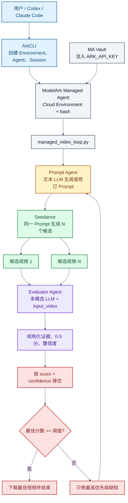

# ArkCLI + Managed Agent：视频生成、直接评测与持续改善

本文给出一个可复现的 BytePlus ModelArk 工作流：Managed Agent 在 Cloud Environment 中运行单文件 Python Runner，由文本 LLM 生成或修订 Seedance Prompt，Seedance 生成多个候选视频，再由多模态 LLM 通过 `input_video` 直接观看、收听并评分。若未达到阈值，Runner 只修复最高优先级缺陷并进入下一轮。

默认策略是最多 5 轮、每轮 2 个候选、目标分数 3.5/5；所有值都可以由用户覆盖。

> 视频生成具有随机性。复现的是调用链、评测契约、停止条件和产物结构，不保证每次得到完全相同的画面或分数。最多 5 轮、每轮 2 个候选意味着最坏情况下生成 10 条视频并产生相应费用。

## 1. 架构



关键边界：把视频 URL 作为普通文本交给 MA，不等于模型已经看过视频。Runner 会调用 ModelArk Responses API，并把临时 URL 放入 `input_video.video_url`；这一步才是真正的视频与音频评测。

## 2. 仓库结构

```text
seedance-managed-video-loop/
├── README.md
├── managed_video_loop.py
├── requirements.txt
├── managed_agent_direct_bootstrap.sh
├── managed_agent_direct_system_prompt.txt
├── docs/
│   ├── guide.zh-CN.md
│   └── guide.en.md
├── tests/
│   └── test_managed_video_loop.py
└── examples/
    └── example-manifest.json
```

`managed_video_loop.py` 是唯一运行入口，包含 Prompt 生成、Seedance 提交与轮询、直接视频评测、候选择优、单缺陷修复、提前停止和视频下载。

## 3. 默认值与用户配置

| 参数 | 默认值 | 含义 |
| --- | ---: | --- |
| `--max-rounds` | `5` | 最多改善轮数 |
| `--candidates` | `2` | 每轮同一 Prompt 的候选数量 |
| `--target-score` | `3.5` | 提前停止阈值，合法范围 0-5 |
| `--timeout` | `1200` | 每个视频任务的轮询超时秒数 |
| `--video-model` | `dreamina-seedance-2-5-260628` | 视频生成模型 |
| `--prompt-model` | `seed-2-0-lite-260428` | Prompt Agent 模型 |
| `--evaluator-model` | `seed-2-0-lite-260428` | 直接视频评测模型 |

不传参数即使用默认值：

```bash
python managed_video_loop.py
```

用户可以按成本、质量和时延覆盖任意值：

```bash
python managed_video_loop.py \
  --max-rounds 3 \
  --candidates 4 \
  --target-score 4.2 \
  --timeout 1800 \
  --prompt-model seed-2-0-lite-260428 \
  --evaluator-model seed-2-0-lite-260428
```

## 4. 前置条件

1. BytePlus 账号已开通 ModelArk、Managed Agents、Seedance 和所需模型。
2. BytePlus ArkCLI 已安装并通过 BytePlus SSO 登录。
3. 当前 Profile 为 `tenant=byteplus`、`region=ap-southeast-1`。
4. 一个可用的 ModelArk API Key。
5. Python 3.10 或更高版本。

检查 ArkCLI：

```bash
npm config delete registry
npm install -g @byteplus/ark-cli@latest
arkcli auth login
arkcli auth status --format json
arkcli profile show --format json
```

应确认：

```json
{
  "tenant": "byteplus",
  "region": "ap-southeast-1",
  "base_url": "https://ark.ap-southeast.bytepluses.com/api/v3"
}
```

## 5. 本地运行

```bash
git clone https://github.com/xieyongliang/seedance-managed-video-loop.git
cd seedance-managed-video-loop
python3 -m venv .venv
.venv/bin/pip install -r requirements.txt

export ARK_API_KEY="<your-modelark-api-key>"
.venv/bin/python managed_video_loop.py
```

使用自定义 brief：

```bash
.venv/bin/python managed_video_loop.py \
  --brief-file ./my-video-brief.txt \
  --max-rounds 3 \
  --candidates 2 \
  --target-score 4.0
```

默认 brief 使用两张公开参考图、一段参考视频和一段参考音频。若要构建其他业务示例，可修改代码中的 `REFERENCES`，并通过 `--brief-file` 提交对应要求。

不调用线上 API、不产生视频费用的离线测试：

```bash
.venv/bin/python -m unittest discover -s tests -v
```

## 6. 每轮如何工作

1. Prompt Agent 根据原始 brief 生成可直接提交给 Seedance 的英文 Prompt。
2. Runner 将原始 brief 追加为不可丢失约束，避免后续修订偏离目标。
3. Seedance 使用完全相同的 Prompt 生成多个独立候选。
4. Runner 轮询任务并取得临时 `video_url`。
5. Evaluator Agent 通过 `input_video` 直接观看和收听每个候选。
6. Evaluator 返回结构化证据、分数、置信度、通过项和失败项。
7. Runner 按 `(score, confidence)` 选择最佳候选。
8. 达到阈值即停止；否则只把最高优先级缺陷交给下一轮 Prompt Agent。

缺陷优先级默认考虑：精确对白、视角、意外文字、时间线动作、连续性和音频。Evaluator 也会返回 `highest_priority_failure`，供下一轮定向修复。

## 7. 直接视频评测契约

Evaluator 必须根据可观察证据评分，不能仅根据画面推断声音。返回 JSON 包含：

- `score`：0-5
- `confidence`：0-1
- `summary`
- 带时间戳的 `timeline`
- `visual_evidence` 和 `audio_evidence`
- `exact_speech`
- `continuity_issues` 和 `unintended_text`
- `passed_requirements` 和 `failed_requirements`
- `highest_priority_failure`
- `improvement_instruction`

评分口径：

| 分数 | 含义 |
| ---: | --- |
| 5 | 所有重要要求通过，无实质缺陷 |
| 4 | 基本完整，仅有轻微缺陷 |
| 3 | 可用，但存在一个或多个明显失败项 |
| 2 | 多个主要要求失败 |
| 1 | 与 brief 匹配度很低 |
| 0 | 无效、不可访问或完全无关 |

## 8. 运行产物

```text
runs/<run-id>/
├── config.json
├── manifest.json
└── round-01/
    ├── prompt.txt
    ├── llm_prompt_generation.json
    ├── summary.json
    ├── candidate-01/
    │   ├── seedance_submit.json
    │   ├── seedance_result.json
    │   ├── llm_video_evaluation.json
    │   └── summary.json
    └── candidate-02/
        ├── ...
        └── video.mp4
```

只有每轮最佳候选会下载为 `video.mp4`。`runs/` 包含临时签名 URL 和运行数据，因此已被 `.gitignore` 排除。

## 9. 在 Managed Agent 中运行

### 9.1 创建 Vault

安全地准备 `./secrets/ark-api-key.txt`，文件中只放 API Key。不要把值写入命令历史。

```bash
arkcli agent vault create \
  --display-name "arkcli-video-loop-vault-$(date -u +%Y%m%d%H%M%S)" \
  --format json

export VAULT_ID="vlt-xxxxxxxx"

arkcli agent vault credentials create "$VAULT_ID" \
  --display-name ark-api-key \
  --secret-name ARK_API_KEY \
  --secret-value @./secrets/ark-api-key.txt \
  --networking-type limited \
  --allowed-host ark.ap-southeast.bytepluses.com \
  --format json
```

### 9.2 创建 Cloud Environment

```bash
arkcli agent env create \
  --name "arkcli-video-loop-env-$(date -u +%Y%m%d%H%M%S)" \
  --description "Direct LLM video generation and evaluation loop" \
  --config '{Type: cloud, Networking: {Type: unrestricted}}' \
  --setup-script @managed_agent_direct_bootstrap.sh \
  --format json

export ENV_ID="env-xxxxxxxx"
```

### 9.3 创建 Agent

先从 MA 白名单选择主模型：

```bash
arkcli agent model list \
  --query "coding bash workflow orchestration" \
  --primary-only \
  --format json

export MA_MODEL_ID="<items[].model>"
```

创建前预览：

```bash
arkcli agent agent create \
  --name "arkcli-direct-video-loop-$(date -u +%Y%m%d%H%M%S)" \
  --description "Run direct LLM video generation and evaluation inside MA" \
  --model "$MA_MODEL_ID" \
  --system @managed_agent_direct_system_prompt.txt \
  --dry-run \
  --format json
```

确认默认工具包含 `bash`、`read` 和 `write` 后，删除 `--dry-run` 真实创建并保存 `Result.Id`：

```bash
export AGENT_ID="agent-xxxxxxxx"
```

### 9.4 创建 Session 并挂载 Runner

```bash
arkcli agent session create \
  --agent-id "$AGENT_ID" \
  --environment-id "$ENV_ID" \
  --vault-id "$VAULT_ID" \
  --title "Direct Seedance video evaluation" \
  --format json

export SESSION_ID="session-xxxxxxxx"

arkcli agent session resources add "$SESSION_ID" \
  --path ./managed_video_loop.py \
  --mount-path managed_video_loop.py \
  --format json
```

文件会挂载到：

```text
/mnt/session/uploads/managed_video_loop.py
```

### 9.5 启动任务

```bash
arkcli agent session events send "$SESSION_ID" \
  --type user.message \
  --text 'Run the mounted video loop. Use max 5 rounds, 2 candidates per round, target score 3.5, and timeout 1200 seconds. Never print credentials. Return the final manifest summary and selected video path.' \
  --poll \
  --wait-timeout 7200 \
  --format json
```

若 polling 超时，继续查询同一个 Session，不要重复发送任务：

```bash
arkcli agent session events list "$SESSION_ID" --page-all --format json
arkcli +tail "$SESSION_ID"
```

## 10. 验收标准

- Prompt Agent 生成可直接提交给 Seedance 的 Prompt。
- 同轮候选使用相同 Prompt，但 task ID 不同。
- Evaluator 的请求包含 `input_video`，并返回视听证据。
- `audio_tokens > 0`，且输出包含对白、音乐或音效判断。
- Evaluator 返回 0-5 分、置信度和最高优先级缺陷。
- Runner 正确择优、达到阈值停止、未达到时只修一个缺陷。
- 总轮数不超过用户配置。
- Agent Session events 中出现 bash 调用和 Runner 输出。
- Agent 配置不依赖公网 MCP。

## 11. 安全与持久化

- 仓库只需要 `ARK_API_KEY`，通过环境变量或 MA Vault 注入。
- 不要提交 `.env`、Secret 源文件、`runs/` 或生成视频。
- Seedance 的 `video_url` 是临时签名地址；评测可直接使用，但最终交付应下载或转存到受控 Object Storage。
- `examples/example-manifest.json` 是不含资源 ID、本机路径和签名 URL 的产物结构示例，不是线上实测结果。

## 12. 当前验证状态

- 单文件 Runner 已移除外部 Prompt/Eval SDK，只依赖 `requests`。
- Python 编译和 CLI 默认值已验证。
- 离线模拟测试覆盖 Prompt 解析、直接视频评测 payload、候选择优和聚焦修复。
- MA Environment 和 Agent 创建请求可通过 ArkCLI `--dry-run` 验证。
- 修改后的无外部评测版本仍需完成一次真实 MA Cloud Session 端到端运行。
